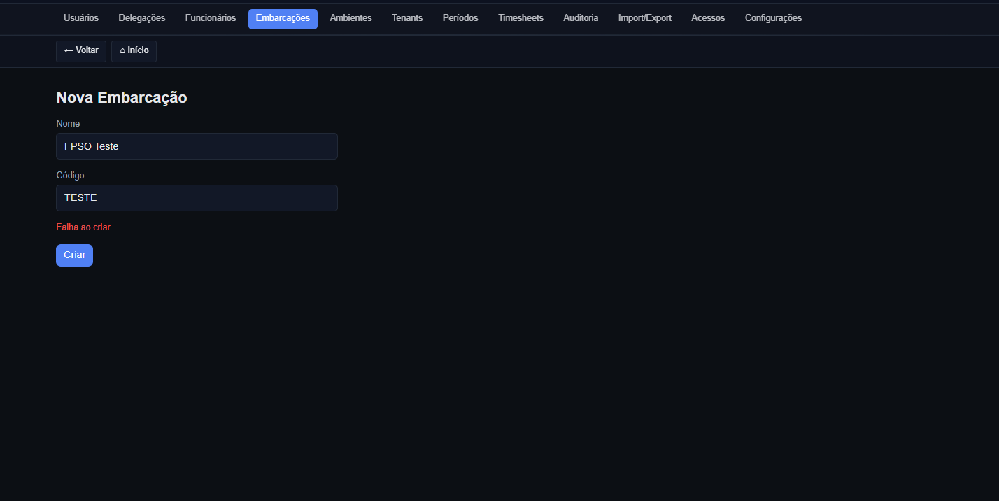

[ ] NAME:Current Task List DESCRIPTION:Root task for conversation __NEW_AGENT__
-[/] NAME:Investigate/Triage/Understand the problem DESCRIPTION:Diagnose why login is failing (password compare false), locate seeding/hashing for users_unified, check documented credentials, list docs (including timesheet PDF) and assess whether our system has an equivalent feature to the client Omega manual.
-[/] NAME:Investigate/Triage/Understand the problem: OMEGA PDF requirements and current implementation DESCRIPTION:Study docs/Timesheets - How To Freelance.pdf, docs/export/OMEGA-mapping-v1.md, existing generator and API. Identify gaps to generate a real OMEGA-compliant PDF and propose minimal plan.
-[x] NAME:Investigate/Triage: Delegations (Admin) scope and schema DESCRIPTION:Review docs/Regras-e-Tarefas.md and schema-v1_1.sql for groups, manager_group_assignments, employee_group_members. Check if any existing Admin UI/API exists. Define minimal MVP for Admin > Delegations module.
-[x] NAME:Implement Admin API: groups CRUD + manager assignments + employee memberships DESCRIPTION:Create endpoints under /api/admin/delegations: groups (GET/POST, GET/PATCH/DELETE), assignments (POST/DELETE), members (POST/DELETE). Enforce requireApiRole(['ADMIN']). Use Supabase tables: groups, manager_group_assignments, employee_group_members. Return localized error messages.
-[x] NAME:Build Admin UI: Delegations pages (list/create/edit/details) DESCRIPTION:Routes under /[locale]/admin/delegations: list groups; create group; edit group; group detail panel to assign managers and manage employee members. Use theme tokens and next-intl translations.
-[x] NAME:Translations and theming polish DESCRIPTION:Add i18n keys for admin.delegations in pt-BR and en-GB; ensure all UI strings use t(); ensure high-contrast tokens for buttons/labels/inputs.
-[/] NAME:Validate module DESCRIPTION:Run type-check; smoke test endpoints with minimal calls; review against docs/Regras-e-Tarefas.md section 3/6 (delegation) and schema v1.1.
-[x] NAME:Investigate/Triage/Understand gaps and errors DESCRIPTION:Map existing routes, APIs, and components across Admin/Manager/Employee; confirm theme cookie fixes; identify missing modules (Tenants UI missing; Periods requires API/DB).
-[x] NAME:Enhance Admin sub‑navigation styling and visibility DESCRIPTION:Make AdminNav look modern (pills, backdrop blur, gradient divider) and ensure modules are visible.
-[x] NAME:Implement Admin > Tenants UI (List + Create) DESCRIPTION:Create /[locale]/admin/tenants (list) and /[locale]/admin/tenants/new (form) consuming /api/admin/tenants GET/POST.
-[x] NAME:Modernize Manager > Review page UI DESCRIPTION:Apply design system tokens, card sections, improved table styling; keep existing actions endpoints.
-[/] NAME:Confirm scope and data model for Admin > Periods DESCRIPTION:Agree on behavior (open/close month), DB needs (e.g., period_locks table) and API contract before implementing.
-[/] NAME:Mapear fluxos e gerar mind map + diagramas de workflows DESCRIPTION:Ler docs (docs/*), mapear módulos e fluxos do sistema (Auth, i18n, Tema, Employee, Manager, Admin, Notificações, Period Locks, Import/Export, Reports) e produzir um mind map e fluxogramas-chave para validação.
-[x] NAME:Manager edit in closed periods – API with mandatory justification DESCRIPTION:Create manager endpoints (POST/PATCH/DELETE /api/manager/timesheets/[id]/entries...) requiring role (ADMIN|MANAGER|MANAGER_TIMESHEET), enforce group auth, allow edits in closed periods only if justification is provided (except ADMIN). Persist justification in audit_log (action=manager_edit_closed_period) with newValues and reference to entry/timesheet.
-[/] NAME:Manager panel UI – justification modal and integration DESCRIPTION:In manager UI, when attempting to edit in a closed period and role is not ADMIN, show a modal requiring justification. Submit to manager endpoints; handle success/error; visually tag entries edited with justification if needed.
--[/] NAME:Manager panel UI – justification modal and integration DESCRIPTION:In manager UI, when attempting to edit in a closed period, show mandatory justification modal and call manager endpoints; visualize rows adjusted with justification; send notifications.
-[ ] NAME:Reports and Declaration for justified edits DESCRIPTION:Build API and UI to list exceptional edits (from audit_log) filtered by period/manager/employee; implement export and a declaration generator (PDF/HTML) with manager, employee, period, entries affected and justification.
-[ ] NAME:Admin Timesheets UX improvements DESCRIPTION:Enhance /admin/timesheets with autocomplete (name/email), filters by status and month; show groups/gerentes in the employee months list; add CSV export of entries for the selected month.
-[ ] NAME:Audit page and API expansion + i18n fix DESCRIPTION:Update /api/admin/audit to read audit_log with filters + pagination; update the Admin audit page to display filtered results, expandable old/new values, exports; fix corrupted Portuguese strings.
-[ ] NAME:Propagate audit logging across remaining endpoints DESCRIPTION:Add logAudit calls to users/employees/vessels/environments/groups/assignments/tenants CRUD, and to submit actions, with consistent action/resourceType/resourceId/old/new values.
-[ ] NAME:Configure OWNER_EMAIL and verify protections DESCRIPTION:Set OWNER_EMAIL=caio.correia@groupabz.com in environment; verify put/delete protections for owner; document the requirement.
-[ ] NAME:Verify DB schema for user_permissions and audit_log DESCRIPTION:Check Supabase project for presence of user_permissions and audit_log tables; add safe indexes/constraints and RLS as appropriate; ensure no cross-project breakage.
-[ ] NAME:Tests for new flows DESCRIPTION:Add unit/integration tests for manager justification API, UI flow, reports, and admin timesheets pages; run and fix until green.
-[ ] NAME:Documentation updates DESCRIPTION:Update README and .env.example: OWNER_EMAIL, manager justification policy, audit/exports usage, and admin timesheets workflow steps.
-[ ] NAME:RBAC and menu visibility double-check DESCRIPTION:Re-verify admin/manager/employee menus and route protections; ensure non-privileged users cannot see admin pages or manager tools.
-[ ] NAME:Employee Acknowledgement UI DESCRIPTION:Employee portal page lists manager_edit_closed_period adjustments awaiting ciência; show details and allow Accept/Decline with optional note; call POST /api/employee/audit/[auditId]/acknowledge and reflect status.
-[ ] NAME:Integrate PDF generation into Admin UI DESCRIPTION:On Admin > Audit/Reports and Timesheet view, add actions to open/print/download the legal declaration; use /api/admin/declarations/manager-edit/[auditId]?format=pdf; include logo/watermark.
-[x] NAME:Current Task List DESCRIPTION:Root task for conversation __NEW_AGENT__
-[ ] NAME:Investigate/Triage/Understand the problem DESCRIPTION:Diagnose why login is failing (password compare false), locate seeding/hashing for users_unified, check documented credentials, list docs (including timesheet PDF) and assess whether our system has an equivalent feature to the client Omega manual.
-[/] NAME:PRIORITY: Manager edit modal (PATCH) – justification flow in UI DESCRIPTION:Add an Edit action in Manager timesheet entries with a modal. On submit, call PATCH /api/manager/timesheets/[id]/entries/[entryId] including justification when period is locked. Reflect updates in table and AckStatus; handle errors and disabled state.
-[ ] NAME:PRIORITY: Full-bleed calendar mode for employee editor DESCRIPTION:Add a “full-bleed” mode for the employee timesheet editor to occupy full viewport width/height (beyond container max-width) on the editor page, with a toggle or page-specific layout override.
