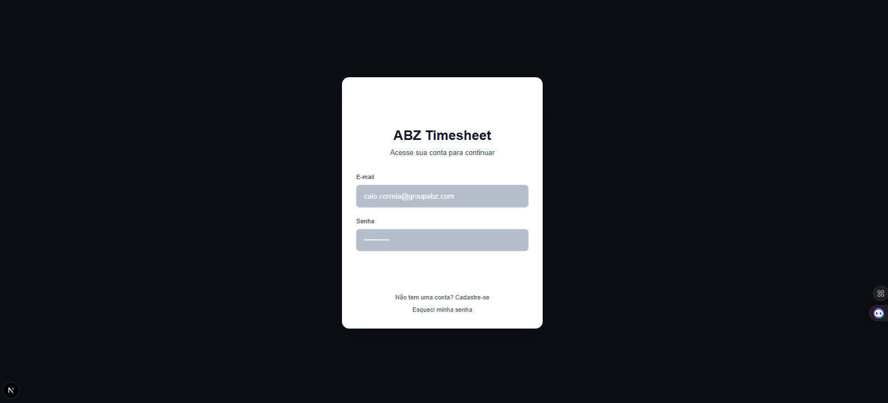
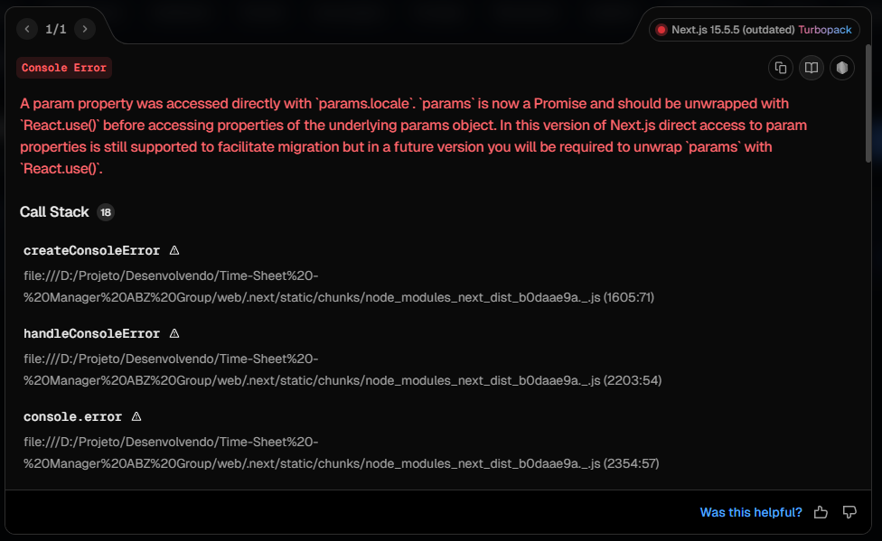

[ ] NAME:Current Task List DESCRIPTION:Root task for conversation __NEW_AGENT__
-[x] NAME:Investigate/Triage – Employee list error and calendar visibility DESCRIPTION:Identify why the employee timesheets list shows an error and ensure the calendar editor is reachable. Inspect list page, editor page, and related API.
-[x] NAME:Fix employee list: align schema, avoid invalid UUID, add current-month shortcut DESCRIPTION:Update employee list page to only query when employee exists, render periodo_ini/periodo_fim + status, and add shortcut link to /employee/timesheets/current.
-[x] NAME:Implement full‑bleed calendar mode for editor DESCRIPTION:Wrap TimesheetEditor in a FullBleed container to extend to full viewport width and ensure tall layout.
-[x] NAME:Validate in UI: employee list loads and editor shows full‑bleed calendar DESCRIPTION:Run a quick manual smoke test in the browser: list page shows rows or empty state without error; creating/opening timesheet shows calendar stretched full width.
-[x] NAME:Employee self-bootstrap flow DESCRIPTION:Create server page /employee/bootstrap to upsert profile and create employees row for the current user, then redirect to the current month timesheet. Add CTA in the list page when not linked.
-[x] NAME:Admin panel – scope and execution plan DESCRIPTION:Inventory existing admin modules (users, employees, delegations, timesheets), identify gaps vs. backlog, and plan iterations to implement all required modules for testing.
-[x] NAME:Fix: Client function props in Admin Delegations (GroupForm/GroupDetailPanel) DESCRIPTION:Refactor client components to use useTranslations instead of receiving t from server; update server pages to stop passing functions.
-[x] NAME:Fix: Hydration mismatch in ThemeToggle DESCRIPTION:Defer dynamic title and icon to post-mount and add a stable pre-mount render to avoid SSR/CSR mismatch.
-[x] NAME:Fix: Manager Pending – invalid URL on server fetch DESCRIPTION:Build absolute base URL from request headers (x-forwarded-proto/host) with fallback to NEXT_PUBLIC_BASE_URL, then call the API.
-[x] NAME:Fix: Admin Tenants POST failing under RLS DESCRIPTION:Use getServerSupabase (with user session) instead of raw anon client so RLS permits admin insert; keep logging for debugging.
-[x] NAME:Admin – Usuários: filtros, paginação e SSR Supabase DESCRIPTION:Adicionar busca (q), filtro por role e status, paginação server-side e trocar para getServerSupabase no list/edit.
-[ ] NAME:Admin – Colaboradores: melhorar CRUD e filtros DESCRIPTION:Substituir prompts por formulário de edição, adicionar filtros/busca e preparar importação CSV (endpoint + UI inicial).
-[x] NAME:Stabilizar Admin – Server Components e SSR fetch DESCRIPTION:Trocar createClient por getServerSupabase em páginas Server do Admin (delegations, access-control, settings, timesheets/view) e padronizar fetch SSR com base absoluta via headers.
-[/] NAME:Stabilizar Admin – APIs Admin com getServerSupabase DESCRIPTION:Migrar rotas /api/admin de createClient(anon) para getServerSupabase para respeitar sessão/RLS (employees, environments, periods, permissions, audit, vessels, delegations, users, settings, declarations).
-[x] NAME:Corrigir strings corrompidas (Admin → Vessels New) DESCRIPTION:Ajustar labels/textos com caracteres quebrados na tela Nova Embarcação.
-[x] NAME:Admin – Tenant Switcher global e padronização nas listas DESCRIPTION:Adicionar TenantSwitcher no layout do Admin; padronizar listas (Ambientes, Embarcações, Funcionários) com tratamento 409 tenant_required e botão "Selecionar tenant"; corrigir prompts para não enviar valores em branco ao cancelar.
-[x] NAME:Admin – Tenants > Associações (gestão em lote) DESCRIPTION:Criar página /admin/tenants/associations para gerenciar quais funcionários pertencem ao tenant atual e API PATCH/GET /api/admin/tenants/associations para adicionar/remover em lote.
-[x] NAME:Correção Next.js 15: await headers() em páginas Admin DESCRIPTION:Auditar pontos críticos e aplicar await em headers() onde necessário (ex.: /admin/delegations/groups/[id], /admin/timesheets/view/[id]).
-[/] NAME:Investigate/Triage – Employees tab error 'column employees.profile_id does not exist' DESCRIPTION:Confirm current database schema for public.employees, verify columns and constraints, and review API/UI usage of profile_id to determine safest fix.
-[ ] NAME:DB migration – Ensure employees.profile_id exists and is linked to profiles(user_id) DESCRIPTION:Run idempotent SQL: add column if not exists, backfill from employees.user_id when present, add FK constraint, index, and set NOT NULL only if safe. Validate RLS policies referencing profile_id.
-[ ] NAME:Verify and polish Employees module DESCRIPTION:Reload Admin > Funcionários, confirm list loads with display_name/email, test Add/Update/Delete, and ensure tenant 409 flow works.
-[ ] NAME:Plan/Implement Periods hierarchy with overrides (Tenant→Environment→Group→Employee) DESCRIPTION:Design tables and APIs for hierarchical period locks, implement resolver and initial UI (tabs), update checks to use effective lock.