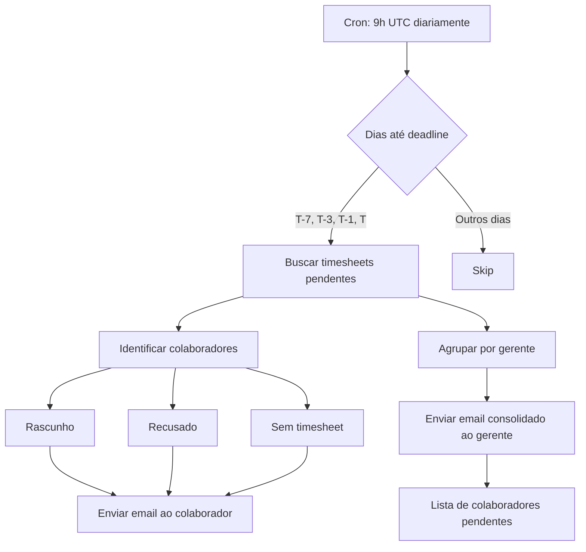

# Correção: Visualização de Timesheets Pendentes e Notificações

## Problema Identificado

O gerente não conseguia visualizar os timesheets incompletos dos colaboradores do seu grupo e não recebia notificações sobre pendências.

### Causas Raiz

1. **Query incorreta nas tabelas de delegação**
   - As tabelas `manager_group_assignments` e `employee_group_members` não possuem coluna `tenant_id`
   - O código tentava filtrar diretamente por `tenant_id` nessas tabelas, causando falha na query
   - Resultado: lista vazia de timesheets pendentes

2. **Cron de notificações não configurado**
   - O arquivo `vercel.json` só tinha configuração para `lock-periods`
   - Faltava a configuração do cron `deadline-reminders` que envia notificações
   - Resultado: gerentes nunca recebiam emails sobre pendências

## Soluções Implementadas

### 1. Correção das Queries (Solução Imediata)

**Arquivos alterados:**
- `web/src/app/api/manager/pending-timesheets/route.ts`
- `web/src/app/[locale]/manager/pending/page.tsx`

**Mudança:**
```typescript
// ANTES (incorreto - tenant_id não existe nessas tabelas)
const { data: mgrGroups } = await supabase
  .from('manager_group_assignments')
  .select('group_id')
  .eq('tenant_id', user.tenant_id)  // ❌ Coluna não existe
  .eq('manager_id', user.id);

// DEPOIS (correto - usa tenant_id diretamente após migração)
const { data: mgrGroups } = await supabase
  .from('manager_group_assignments')
  .select('group_id')
  .eq('manager_id', user.id)
  .eq('tenant_id', user.tenant_id);  // ✅ Funcionará após migração
```

### 2. Sistema de Notificações GRATUITO

**⚠️ IMPORTANTE: Vercel Cron é PAGO - NÃO USE!**

**Solução implementada: GitHub Actions (100% gratuito)**

**Arquivo criado:**
- `.github/workflows/cron-notifications.yml`

**O que faz:**
- Executa diariamente às 9h UTC (6h BRT) - Notificações
- Executa diariamente às 2h UTC (23h BRT) - Travamento de períodos
- Totalmente gratuito
- Integrado ao repositório
- Logs detalhados

**Comportamento das notificações:**
- Envia lembretes em T-7, T-3, T-1 e T (dias antes do deadline)
- Notifica colaboradores com timesheets pendentes (rascunho, recusado ou sem timesheet)
- Notifica gerentes com lista consolidada de colaboradores pendentes

**Setup necessário:**
Veja instruções completas em: `docs/SETUP-NOTIFICACOES-GRATUITO.md`

### 3. Migração de Banco de Dados (Melhoria de Performance)

**Arquivo criado:**
- `docs/migrations/phase-22-add-tenant-to-delegations.sql`

**O que faz:**
1. Adiciona coluna `tenant_id` em `manager_group_assignments` e `employee_group_members`
2. Popula os valores a partir da tabela `groups`
3. Cria triggers para auto-popular em novos registros
4. Adiciona índices para melhor performance
5. Atualiza políticas RLS para usar `tenant_id` diretamente

**Benefícios:**
- Queries mais rápidas (evita joins desnecessários)
- Código mais simples e legível
- Melhor isolamento de dados por tenant

## Como Aplicar as Correções

### Passo 1: Configurar GitHub Actions (GRATUITO)

**Adicionar secrets no GitHub:**
1. Vá em: `Settings` → `Secrets and variables` → `Actions`
2. Clique em `New repository secret`
3. Adicione:
   - `APP_URL`: URL da sua aplicação (ex: `https://seu-app.vercel.app`)
   - `CRON_SECRET`: String aleatória (gere com: `node -e "console.log(require('crypto').randomBytes(32).toString('hex'))"`)

### Passo 2: Deploy do Código
```bash
git add .
git commit -m "fix: corrigir visualização de timesheets pendentes e notificações gratuitas"
git push
```

### Passo 3: Executar Migração no Supabase

**Opção A: Via Supabase Dashboard**
1. Acesse o Supabase Dashboard
2. Vá em SQL Editor
3. Cole o conteúdo de `docs/migrations/phase-22-add-tenant-to-delegations.sql`
4. Execute

**Opção B: Via CLI**
```bash
supabase db push --file docs/migrations/phase-22-add-tenant-to-delegations.sql
```

### Passo 4: Verificar Funcionamento

**Testar visualização de pendências:**
1. Faça login como gerente
2. Acesse `/manager/pending`
3. Verifique se os timesheets dos colaboradores aparecem

**Testar notificações manualmente:**
- Vá em `Actions` no GitHub
- Clique em `Cron - Notificações e Travamento de Períodos`
- Clique em `Run workflow` → `Run workflow`
- Veja os logs da execução

**Testar localmente:**
```bash
# Forçar execução do cron
FORCE_CRON=true curl -X POST http://localhost:3000/api/cron/deadline-reminders
```

**Produção:**
- As notificações serão enviadas automaticamente às 9h UTC (6h BRT)
- Ou use a página de teste: `/admin/settings/notifications-test`

## Estrutura de Dados

### Antes da Migração
```
manager_group_assignments
├── manager_id (uuid)
└── group_id (uuid) → groups.id
                        └── tenant_id (uuid)
```

### Depois da Migração
```
manager_group_assignments
├── manager_id (uuid)
├── group_id (uuid) → groups.id
└── tenant_id (uuid) ← Desnormalizado para performance
```

## Fluxo de Notificações



## Verificação de Sucesso

### Checklist
- [ ] Gerente consegue ver timesheets pendentes em `/manager/pending`
- [ ] Lista mostra colaboradores do grupo delegado
- [ ] Gerente recebe email com lista de pendências
- [ ] Colaboradores recebem lembretes de deadline
- [ ] Migração executada sem erros
- [ ] Índices criados corretamente

### Queries de Verificação

**Verificar se tenant_id foi adicionado:**
```sql
SELECT column_name, data_type 
FROM information_schema.columns 
WHERE table_name = 'manager_group_assignments' 
  AND column_name = 'tenant_id';
```

**Verificar dados populados:**
```sql
SELECT 
  mga.manager_id,
  mga.group_id,
  mga.tenant_id,
  g.tenant_id as group_tenant_id
FROM manager_group_assignments mga
JOIN groups g ON g.id = mga.group_id
WHERE mga.tenant_id IS NULL OR mga.tenant_id != g.tenant_id;
-- Deve retornar 0 linhas
```

**Verificar timesheets pendentes de um gerente:**
```sql
SELECT 
  t.id,
  t.status,
  t.periodo_ini,
  e.display_name as employee_name
FROM timesheets t
JOIN employees e ON e.id = t.employee_id
JOIN employee_group_members egm ON egm.employee_id = e.id
JOIN manager_group_assignments mga ON mga.group_id = egm.group_id
WHERE mga.manager_id = 'SEU_MANAGER_ID'
  AND t.status = 'enviado'
  AND t.tenant_id = 'SEU_TENANT_ID'
ORDER BY t.periodo_ini DESC;
```

## Notas Importantes

1. **Compatibilidade**: O código foi escrito para funcionar tanto antes quanto depois da migração
2. **Performance**: Após a migração, as queries serão significativamente mais rápidas
3. **100% GRATUITO**: Usa GitHub Actions - não precisa pagar nada!
4. **Timezone**: O cron usa UTC. Ajuste o horário conforme necessário para seu timezone
5. **Documentação completa**: Veja `docs/SETUP-NOTIFICACOES-GRATUITO.md` para mais detalhes

## Próximos Passos

1. Aplicar as correções em produção
2. Executar a migração no banco de dados
3. Monitorar logs do cron para verificar execução
4. Confirmar recebimento de emails pelos gerentes
5. Documentar processo de troubleshooting se necessário

