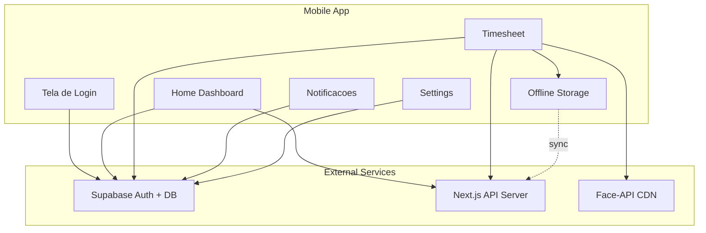

# Analise Completa do Projeto Mobile PontoFlow

## Resumo Executivo

O projeto mobile PontoFlow é uma aplicacao Expo Router baseada em React Native que se conecta a um backend Supabase e uma API Next.js. Foram identificados varios problemas criticos que impedem o funcionamento completo do aplicativo e a geracao do APK Android.

---

## 1. PROBLEMAS CRITICOS IDENTIFICADOS

### 1.1 Configuracao de Ambiente (CRITICO)

**Problema:** O arquivo `mobile/lib/supabase.ts` possui valores padrão invalidos que causam falha na conexao.

```typescript
// ATUAL (PROBLEMATICO)
const supabaseUrl = process.env.EXPO_PUBLIC_SUPABASE_URL || 'YOUR_SUPABASE_URL';
const supabaseAnonKey = process.env.EXPO_PUBLIC_SUPABASE_ANON_KEY || 'YOUR_SUPABASE_ANON_KEY';
```

**Issues:**
- Se as variaveis de ambiente nao forem configuradas, o app tenta conectar a `YOUR_SUPABASE_URL` que e invalido
- Nao ha validacao que impede o app de iniciar com configuracoes invalidas
- O arquivo `.env` existe no diretorio `mobile/` com credenciais reais, mas o Expo pode nao estar lendo corretamente

**Arquivo `.env` atual em `mobile/.env`:**
```
EXPO_PUBLIC_SUPABASE_URL=https://arzvingdtnttiejcvucs.supabase.co
EXPO_PUBLIC_SUPABASE_ANON_KEY=eyJhbGciOiJIUzI1NiIsInR5cCI6IkpXVCJ9...
```

**Problema adicional:** As credenciais estao expostas no repositorio (se houver controle de versao).

---

### 1.2 API Base URL (CRITICO)

**Problema:** O arquivo `mobile/lib/api.ts` usa `localhost` como URL padrão.

```typescript
const API_BASE_URL = process.env.EXPO_PUBLIC_API_URL || 'http://localhost:3000/api';
```

**Issues:**
- Em dispositivos fisicos ou emuladores, `localhost` aponta para o proprio dispositivo, NAO para o servidor
- Em Android, isso causa falha total nas chamadas de API
- Nao ha configuracao para ambiente de producao

**Solucao necessaria:**
- Para desenvolvimento no mesmo WiFi: `http://<IP-DO-PC>:3000/api`
- Para producao: `https://<dominio-do-servidor>/api`

---

### 1.3 Dependencias Faltantes (ALTO)

**Problema:** O arquivo `app/login.tsx` importa `@expo/vector-icons` que NAO esta em `package.json`.

```typescript
import { Feather } from '@expo/vector-icons';
```

**Dependencias possivelmente faltantes:**
- `@expo/vector-icons` (precisa ser adicionado)
- Verificar se todos os modules do Expo estao instalados corretamente

**Lista de dependencias que DEVEM estar em `package.json`:**
```json
"@expo/vector-icons": "^14.0.0"
```

---

### 1.4 Problemas de Importacao com Alias (MEDIO)

**Problema:** O codigo usa aliases que podem nao estar configurados corretamente.

```typescript
import { useColorScheme } from '@/components/useColorScheme';
import Colors from '@/constants/Colors';
import { useClientOnlyValue } from '@/components/useClientOnlyValue';
import EditScreenInfo from '@/components/EditScreenInfo';
import { Text, View } from '@/components/Themed';
```

**Verificacao necessaria:**
- O `tsconfig.json` tem `"@/*": ["./*"]` - isso deve funcionar
- O Metro bundler precisa estar configurado para resolver aliases

---

### 1.5 Tela `two.tsx` Obsoleta (BAIXO)

**Problema:** O arquivo `mobile/app/(tabs)/two.tsx` existe mas nao parece ser parte do funcionalidade principal.
- E uma tela de placeholder do template do Expo
- Pode causar confusao na navegacao

---

### 1.6 BiometricWebView - Dependencia de CDN (MEDIO)

**Problema:** O componente `BiometricWebView` carrega `face-api.js` de CDN externo.

```html
<script src="https://cdn.jsdelivr.net/npm/@vladmandic/face-api@1.7.12/dist/face-api.min.js"></script>
```

**Issues:**
- Em areas sem internet, a biometria nao funciona
- Os modelos sao carregados de `https://vladmandic.github.io/face-api/model/` - tambem requer internet
- Isso contradiz o modulo offline storage

---

## 2. PROBLEMAS DE BUILD DO APK ANDROID

### 2.1 Script de Build Atual

O arquivo `mobile/build-apk-offline.bat` executa:
```batch
cd /d "%ANDROID_DIR%"
call gradlew.bat assembleDebug
```

**Issues identificadas:**

1. **Caminho do gradlew:** O script verifica `gradlew.bat` mas o projeto Expo com Capacitor/EAS pode nao ter o Gradle configurado corretamente.

2. **Configuracao do Android:** O diretorio `mobile/android/` existe com estrutura Gradle, mas:
   - O `app/build.gradle` precisa ter as configuracoes corretas para Expo
   - O `capacitor.config.json` precisa estar configurado

3. **Variaveis de ambiente no build:** As variaveis `EXPO_PUBLIC_SUPABASE_URL`, `EXPO_PUBLIC_SUPABASE_ANON_KEY`, `EXPO_PUBLIC_API_URL` precisam ser injetadas durante o build.

---

### 2.2 EAS Build Configuration

O arquivo `mobile/eas.json` esta configurado:
```json
{
  "build": {
    "development": {
      "developmentClient": true,
      "distribution": "internal"
    },
    "preview": {
      "android": {
        "buildType": "apk"
      }
    },
    "production": {}
  }
}
```

**Issues:**
- O build `production` nao especifica `buildType` para Android (deveria ser `apk` ou `app-bundle`)
- Nao ha configuracao de `android.enterpriseEdits` ou `credentials`
- Para build em cloud EAS, sao necessarias credenciais configuradas

---

### 2.3 Capacitor vs Expo Direct Build

**Problema de arquitetura:** O projeto parece misturar abordagens:

1. `mobile/build-apk-offline.bat` usa Gradle direto (como se fosse Capacitor)
2. `mobile/build-using-python.py` pode ser um script alternativo
3. `eas.json` configura EAS Build (Expo Application Services)
4. `mobile/app.json` tem configuracao Android nativa

**Verificacao necessaria:**
- O projeto usa Capacitor ou Expo Direct Build?
- Se for Capacitor, os arquivos nativos precisam ser gerados com `npx cap sync`
- Se for Expo Direct Build, o build deve ser feito via EAS ou `expo run:android`

---

## 3. ANALISE DO CODIGO FONTE

### 3.1 Estrutura de Navegacao

```
app/
├── _layout.tsx          # Root layout com auth check
├── login.tsx            # Tela de login
├── modal.tsx            # Modal genérico
└── (tabs)/
    ├── _layout.tsx      # Tab navigation layout
    ├── index.tsx        # Home screen (dashboard)
    ├── timesheet.tsx    # Tela de timesheet
    ├── notifications.tsx # Lista de notificações
    ├── settings.tsx     # Configurações
    └── two.tsx          # Placeholder (obsoleto)
```

### 3.2 Fluxo de Autenticacao

O fluxo de autenticacao em `app/_layout.tsx`:

```typescript
// Problema: A navegacao pode piscar antes do session ser verificado
useEffect(() => {
  if (!isInitialized) return;
  
  const inLoginScreen = segments[0] === 'login';
  
  if (!session && !inLoginScreen) {
    router.replace('/login');
  } else if (session && inLoginScreen) {
    router.replace('/(tabs)/');
  }
}, [session, isInitialized, segments]);
```

**Issues:**
- O `return null` quando `!isInitialized` pode causar flash de conteudo
- Nao ha tratamento de erro se a sessao expirar durante o uso

---

### 3.3 Funcoes Criticas

#### Home Screen (`index.tsx`)
- Busca employee profile via Supabase
- Calcula horas do mes atual
- Filtra entries de hoje
- Usa data BRT (UTC-3) para consistencia

#### Timesheet Screen (`timesheet.tsx`)
- Gerencia environments (ambientes de registro)
- Captura foto com camera
- Executa verificacao biométrica via WebView
- Salva registros de ponto

#### Offline Storage (`lib/offline-storage.ts`)
- Implementa fila de operacoes pendentes
- Cache de descriptor facial
- Sincronizacao quando online

---

## 4. DIAGRAMA DE ARQUITETURA



---

## 5. PLANO DE CORRECOES

### FASE 1: Correcoes Criticas (Funcionalidade Basica)

#### 1.1 Corrigir Configuracao de Ambiente
- [ ] Criar arquivo `mobile/.env.example` com template
- [ ] Adicionar validacao de URLs no `supabase.ts`
- [ ] Corrigir `API_BASE_URL` para ambiente mobile
- [ ] Documentar configuracao necessaria

#### 1.2 Adicionar Dependencias Faltantes
- [ ] Adicionar `@expo/vector-icons` ao `package.json`
- [ ] Executar `npm install` para verificar integridade

#### 1.3 Corrigir URLs de API
- [ ] Adicionar suporte a IP dinamico para desenvolvimento
- [ ] Adicionar variavel de ambiente para URL da API

---

### FASE 2: Correcoes de Build (APK Android)

#### 2.1 Verificar Configuracao do Android
- [ ] Verificar `mobile/android/app/build.gradle`
- [ ] Verificar `mobile/android/app/src/main/AndroidManifest.xml`
- [ ] Verificar versao do Gradle wrapper
- [ ] Verificar compatibilidade com Expo SDK 52

#### 2.2 Corrigir Script de Build
- [ ] Adicionar verificacao de Java/SDK
- [ ] Adicionar verificacao de ANDROID_HOME
- [ ] Adicionar log de erro detalhado
- [ ] Suporte para build APK release

#### 2.3 Configurar EAS Build (Alternativa)
- [ ] Configurar projeto EAS se necessario
- [ ] Adicionar credenciais de assinatura
- [ ] Testar build cloud

---

### FASE 3: Melhorias de Funcionalidade

#### 3.1 Biometria Offline
- [ ] Download dos modelos face-api para assets locais
- [ ] Configurar WebView para carregar de assets
- [ ] Tratar fallback quando modelos nao carregam

#### 3.2 Tratamento de Erros
- [ ] Adicionar error boundary global
- [ ] Melhorar mensagens de erro para usuario
- [ ] Adicionar retry logic para operacoes offline

#### 3.3 Limpeza deCodigo
- [ ] Remover `two.tsx` (placeholder)
- [ ] Adicionar tipos TypeScript mais especificos
- [ ] Documentar funcoes criticas

---

## 6. CHECKLIST DE DEPENDENCIAS

### Dependencias que DEVEM estar instaladas:
- [x] `@supabase/supabase-js` (^2.100.1)
- [x] `@react-native-async-storage/async-storage` (1.23.1)
- [x] `expo` (~52.0.46)
- [x] `expo-router` (~4.0.22)
- [x] `expo-camera` (~16.0.18)
- [x] `expo-constants` (~17.0.8)
- [x] `expo-font` (~13.0.4)
- [x] `expo-linking` (~7.0.5)
- [x] `expo-location` (~18.0.10)
- [x] `expo-splash-screen` (~0.29.24)
- [x] `expo-status-bar` (~2.0.1)
- [x] `expo-web-browser` (~14.0.2)
- [x] `react-native` (0.76.7)
- [x] `react-native-reanimated` (~3.16.7)
- [x] `react-native-safe-area-context` (4.12.0)
- [x] `react-native-screens` (~4.4.0)
- [x] `react-native-url-polyfill` (^2.0.0)
- [x] `react-native-webview` (^13.12.5)
- [x] `nativewind` (^4.1.23)
- [ ] `@expo/vector-icons` (FALTANDO - precisa adicionar)

### Dependencias de desenvolvimento:
- [x] `@babel/core` (^7.25.2)
- [x] `tailwindcss` (^3.4.17)
- [x] `typescript` (~5.3.3)

---

## 7. VERIFICACOES NECESSARIAS

### 7.1 Ambiente de Desenvolvimento
```bash
# Verificar versoes
node --version        # >= 18.x
npm --version         # >= 9.x
java --version        # >= 17 (para Android)
./gradlew --version   # Compativel com project
```

### 7.2 Variaveis de Ambiente
```bash
# mobile/.env DEVE conter:
EXPO_PUBLIC_SUPABASE_URL=https://<seu-project>.supabase.co
EXPO_PUBLIC_SUPABASE_ANON_KEY=<seu-anon-key>
EXPO_PUBLIC_API_URL=http://<ip-do-servidor>:3000/api
```

### 7.3 Android SDK
```bash
# Verificar ANDROID_HOME
echo $ANDROID_HOME    # Windows: %ANDROID_HOME%
# Verificar SDK manager
sdkmanager --list
```

---

## 8. RESUMO DOS PROBLEMAS

| Prioridade | Problema | Impacto | Complexidade |
|------------|----------|---------|--------------|
| CRITICO | API URL = localhost | App nao comunica com servidor | Baixa |
| CRITICO | Supabase keys padrao invalidas | Auth falha silenciosamente | Baixa |
| ALTO | @expo/vector-icons faltando | Build falha / app crash | Baixa |
| MEDIO | Biometria depende de CDN | Funcionalidade quebrada offline | Media |
| MEDIO | Configuracao Android incerta | Build pode falhar | Media |
| BAIXO | two.tsx obsoleto | Confusao, mas nao funcional | Baixa |
| BAIXO | Credenciais no repositorio | Risco de seguranca | Baixa |

---

## 9. PROXIMOS PASSOS

1. **Imediato:** Corrigir URLs de API e Supabase
2. **Imediato:** Adicionar dependencia faltante
3. **Curto prazo:** Verificar e corrigir configuracao de build Android
4. **Medio prazo:** Implementar biometria offline
5. **Longo prazo:** Melhorar tratamento de erros e UX
